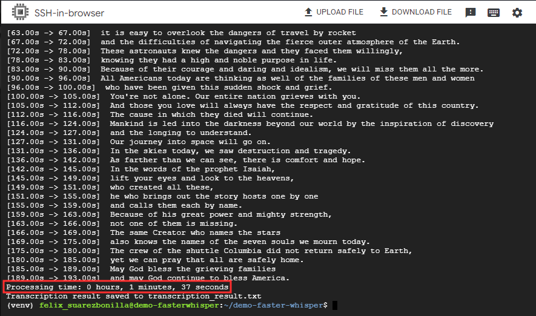
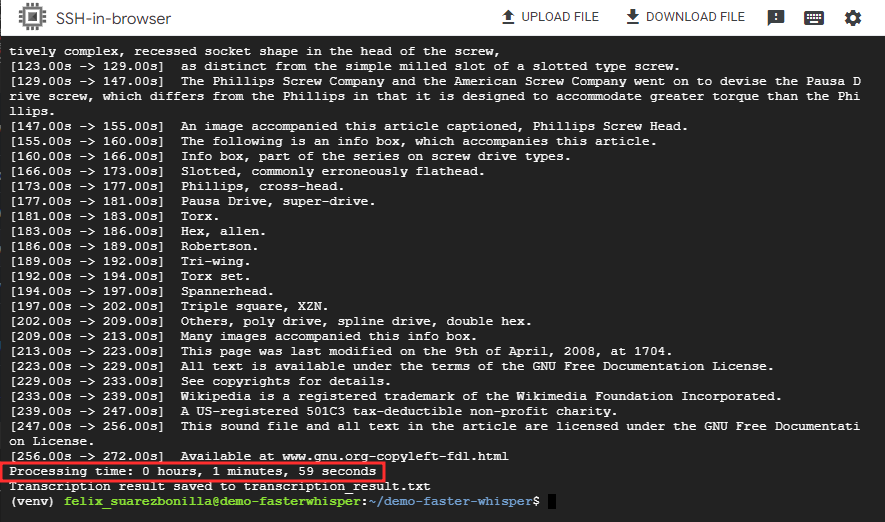
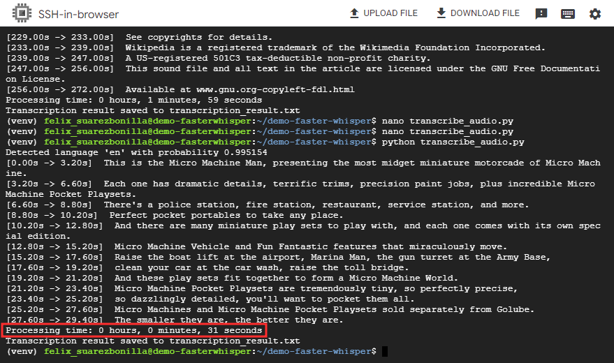
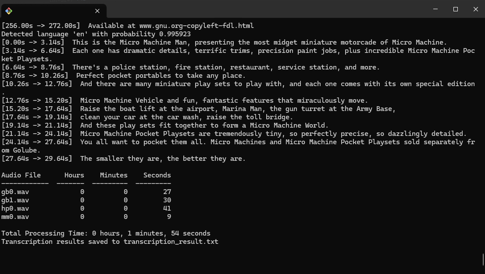

# 🤖 Whisper Transcription

This Python script utilizes the [faster-whisper](https://github.com/SYSTRAN/faster-whisper) package, which is a reimplementation of OpenAI's Whisper model using CTranslate2, for transcribing audio files with the `small` whisper model. [OpenAI's Whisper model](https://github.com/openai/whisper) is an advanced implementation of Automatic Speech Recognition (ASR). It employs modern deep learning techniques to accurately transcribe human speech into text. Whisper has been trained on a large amount of high-quality audio data, enabling it to recognize a wide range of dialects and accents. Its accuracy and speed make it ideal for real-time transcription applications, showcasing its potential to revolutionize speech recognition technology.

## 🛠️Prerequisites

- Python 3.8 or higher
- Docker (optional)

## 🚀 Using Python Script

1. **Set Up a Virtual Environment:**

```bash
python -m venv venv
source venv/Scripts/activate  # On Windows, use `venv\Scripts\activate`
```

2. Install the necessary Python dependencies:

```bash
pip install faster-whisper
```

3. Run the Python script `transcribe_audio.py`. Make sure to replace `audio_files_for_testing/audio_test_1.mp3` with the path to your audio file if necessary:

```bash
python transcribe_audio.py
```

This will transcribe the audio file specified, print on console and save the results to a text file named `transcription_result.txt`.


## 🐳 Using DockerFile for the script

1. Build the Docker image inside the `dockerfile_script` folder:

```bash
docker build -t whisper_transcription_container .
```

2. Execute the python container from outside it

```bash
docker run whisper_transcription_container
```


or

3. Get into the docker container:

```bash
docker run -it --rm whisper_transcription_container bash
```

3. Execute the python script inside the container

```bash
python transcribe_audio.py
```

This will execute the Python script inside the Docker container, transcribe the audio file, and save the results to `transcription_result.txt`.


## ℹ️ Additional Notes

- Ensure that the audio file path specified in the script is correct and accessible.
- The Docker image can be used to run the transcription in an isolated environment without worrying about dependencies.

## 🧑🏻‍💻 Using the Fast API Endpoint

1. Set Up a Virtual Environment:

```bash
python -m venv venv
source venv/Scripts/activate  # On Windows, use `venv\Scripts\activate`
```

2. Install Dependencies:

```bash
pip install -r requirements.txt
```

3. Run the FastAPI Application:

```bash
uvicorn transcription_endpoint:app --reload
```

This will start the FastAPI application, and you can access the endpoint at `http://127.0.0.1:8000/docs#/default/transcribe_audio_transcribe_audio__post`.

4. **Results**


## 🌐🌏 Using the DockerFile for the FastAPI Endpoint:

1. Build the Docker image named `Dockerfile`:

```bash
docker build -t dockerfile_endpoint .
```


2. Run the Docker Container:

```bash
docker run -p 80:8000 dockerfile_endpoint
```

This will start the FastAPI application, and you can access the endpoint at `http://localhost/docs#/default/transcribe_audio_transcribe_audio__post`.

4. **Results**


## 🕵️ Audio File Testing on 4CPU/ 4GB GCP Instance

1. Audio `gb0.wav`

Processing Time: `1 minutes, 18 seconds`


1. Audio `gb1.wav`

Processing Time: `1 minutes, 37 seconds`



2. Audio `hp0.wav`

Processing Time: `1 minutes, 59 seconds`



3. Audio `mm0.wav`

Processing Time: `31 seconds`



**_Comparative table_**

| Audio File | Hours | Minutes | Seconds |
| ---------- | ----- | ------- | ------- |
| gb0.wav    | 0     | 1       | 18      |
| gb1.wav    | 0     | 1       | 37      |
| hp0.wav    | 0     | 1       | 59      |
| mm0.wav    | 0     | 0       | 31      |

**Total Processing Time: 5 minutes, 25 seconds**

## 🕵️ Using the Fast API Endpoint on 4CPU/ 4GB GCP Instance

```bash
uvicorn transcription_endpoint:app --reload --host 0.0.0.0
```


This will start the FastAPI application, and you can access the endpoint at `http://[External_IP]:8000/docs#/default/transcribe_audio_transcribe_audio__post`.


## 🐳 Using the DockerFile Endpoint on 4CPU/ 4GB GCP Instance

```bash
docker build -t dockerfile_endpoint .
docker run -p 8000:8000 dockerfile_endpointnt
```


This will start the FastAPI application, and you can access the endpoint at `http://[External_IP]:8000/docs#/default/transcribe_audio_transcribe_audio__post`.


## 🕵️ Audio File Testing on 6CPU cores/ 16GB Local Machine

1. All audios:

**_Comparative table_**

| Audio File | Hours | Minutes | Seconds |
| ---------- | ----- | ------- | ------- |
| gb0.wav    | 0     | 0       | 27      |
| gb1.wav    | 0     | 0       | 30      |
| hp0.wav    | 0     | 0       | 41      |
| mm0.wav    | 0     | 0       | 9       |

**Total Processing Time: 1 minutes, 54 seconds**


