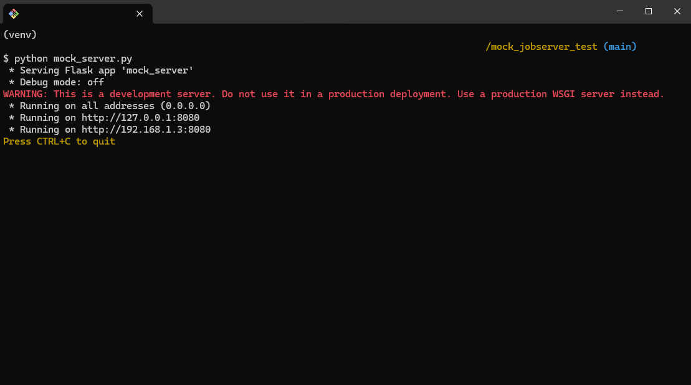
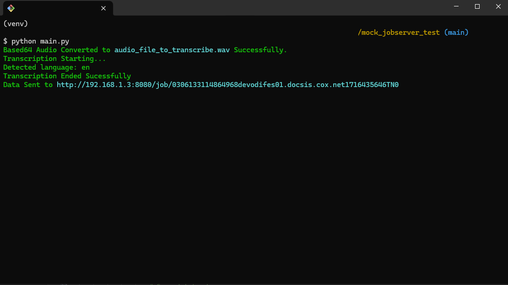
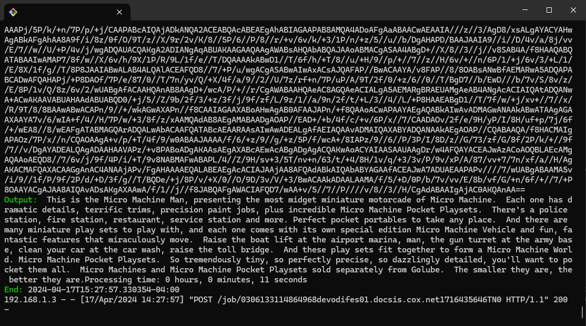
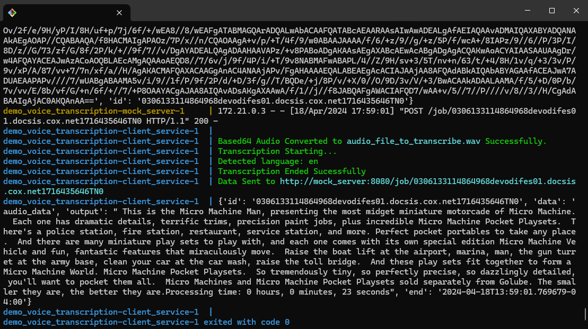
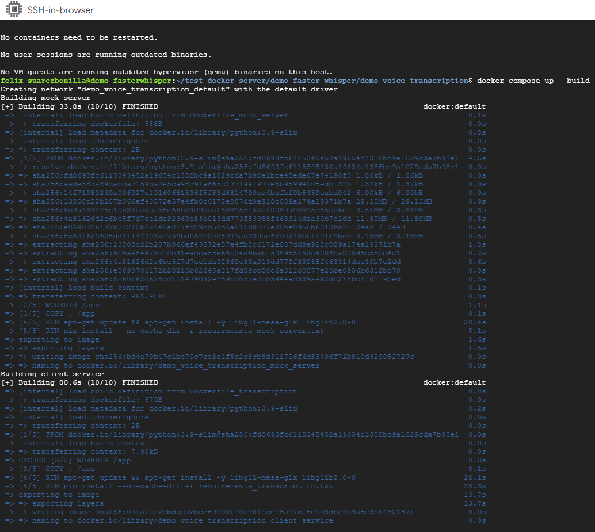
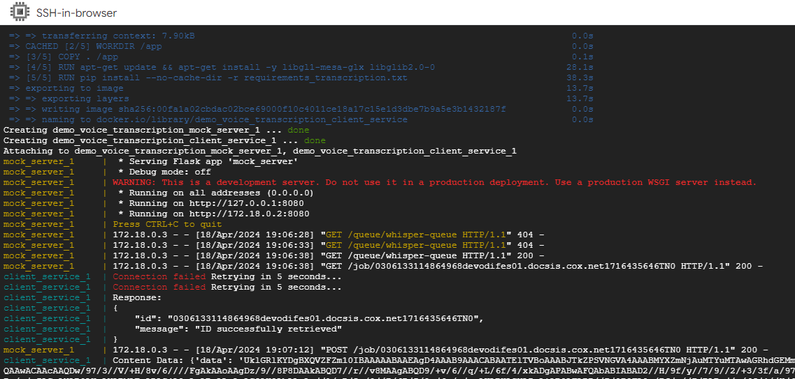
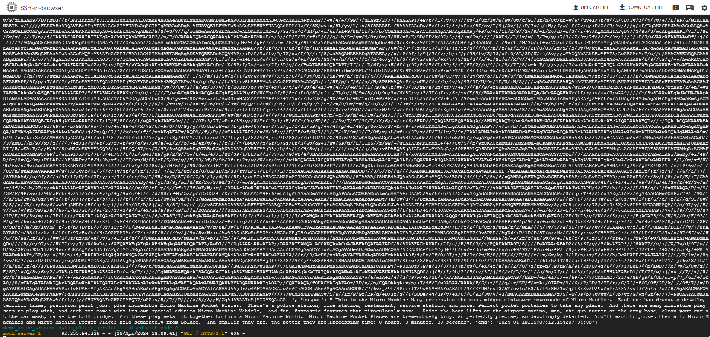

# 💻 Mock Job Server Test

The `demo_voice_transcription` project is a client-server simulation designed for audio transcription. Clients initialize by sending an ID in the `mock_server.py` server via a `GET request`. After initialization, clients receive a `JSON Response` containing data to be processed. This includes an audio file for transcription, which is performed using OpenAI's `small` Whisper Wodel. The transcribed results are then submitted back to the server via a `POST request`.

## Index

1. <div align=left><a href="#prerequisites" style="padding-top: 50px;">🛠️ Prerequisites</a></div>
2. <div align=left><a href="#components" style="padding-top: 50px;">📦 Components</a></div>
3. <div align=left><a href="#usage" style="padding-top: 50px;">🚀 Usage</a></div>
4. <div align=left><a href="#notes" style="padding-top: 50px;">🗒️ Notes</a></div>

<a name="prerequisites"></a>

</br>

## 🛠️ Prerequisites

- Python 3.8 or higher
- Docker (optional)

<a name="components"></a>

</br>

## 📦 Components

### `main.py`

This Python script serves as the core logic for client-side operations. It communicates with the server, initializing the process by sending an `ID`. Upon receiving a `JSON Response`, the script conducts transcription based on the provided data. Subsequently, it prepares a `JSON payload` containing the results to be sent back to the server.

```json
{
  "id": "unique_job_id_123",
  "data": "base64_encoded_audio_data_here",
  "output": "transcribed_text_here",
  "end": "Timestamp"
}
```

### `audio_transcriber.py`

This script provides a function to transcribe audio files using the predefined `small` OpenAI's whisper model.

### `mock_server.py`

This server-side script, developed using the `Flask` framework, simulates a server environment for audio transcription tasks. Below is a brief overview of its functionalities:

### Endpoints

#### GET `/queue/whisper-queue`

- Retrieves the current status of the transcription queue.
- Returns a 404 error if the connection fails.
- Returns the job ID if successfully initialized.

#### GET `/job/<requested_job_id>`

- Fetches content associated with a specific job ID.
- Provides base64-encoded audio data for transcription.
- Returns a 404 error if the audio file is not found or the job ID does not match.

#### POST `/job/<requested_job_id>`

- Handles submission of transcribed results for a specific job ID.
- Expects JSON data with job ID, transcribed text, and completion timestamp.
- Prints received data for verification.
- Returns a success message upon successful POST request.

### `requirements.txt`

A file containing required `Python packages` and their versions for running the project.

<a name="usage"></a>

</br>

## 🚀 Usage

1. **Set Up a Virtual Environment:**

```bash
cd demo_voice_trasncription
python -m venv venv
source venv/Scripts/activate
```

2. **Install Dependencies:**

```bash
pip install -r requirements.txt
```

3. Run the server by executing `python mock_server.py`.

```bash
python mock_server.py
```



It will start the Flask server on `http://[LOCAL_IP_ADDRESS]:8080/`.

4. Execute `main.py` to submit audio data to the server for transcription. Ensure that the server is running before executing the client script.

```bash
python main.py
```



5. **Results:**

`JSON payload` printed on server-side:



### 🐳 Using Docker

1. **Clone the repository:**

```bash
git clone https://github.com/felixsuarez0727/demo-faster-whisper.git
cd demo-faster-whisper/demo_voice_transcription
```

2. **Run the `docker-compose.yml` file:**

```bash
docker-compose up --build
```



### 🧪 Test on GCP Instance 6CPU cores / 6GB RAM

| Test Run                                |
| --------------------------------------- | -------------------------------------- |
|   |  |
|  |

<a name="notes"></a>

</br>

## 🗒️ Notes

- This project is for demonstration purposes and should not be used in production environments without appropriate modifications and security considerations.
- The server (`mock_server.py`) is a simulation and may not have all the features or security measures of a production server.
